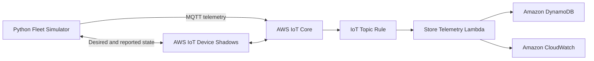

# TempX v2

## Serverless AWS IoT Fleet Telemetry and Device State Platform

TempX v2 is a production-style Internet of Things backend built with Python, AWS IoT Core, AWS Lambda, Amazon DynamoDB, AWS IoT Device Shadows, and Terraform.

The project simulates a fleet of independently authenticated devices that publish temperature and humidity telemetry over MQTT. AWS IoT Core routes each message to a Lambda function, which validates and stores the reading in DynamoDB. Device Shadows preserve desired configuration while a device is offline and reconcile that configuration when it reconnects.

The project is designed to demonstrate more than basic message publishing. It covers secure device identity, event-driven ingestion, time-series data modelling, offline state reconciliation, infrastructure as code, automated testing, and continuous integration.

## Architecture



## Technology Stack

| Area | Technology |
| --- | --- |
| Device simulation | Python, AWS IoT Device SDK for Python v2 |
| Messaging | MQTT over TLS |
| Device gateway | AWS IoT Core |
| State management | AWS IoT Device Shadows |
| Event routing | AWS IoT Rules Engine |
| Compute | AWS Lambda |
| Data storage | Amazon DynamoDB |
| Logging | Amazon CloudWatch Logs |
| Infrastructure | Terraform |
| Testing | Pytest, pytest-cov |
| Continuous integration | GitHub Actions |

## Repository Layout

The repository uses a simple separation between application code, infrastructure, tests, and local device credentials.

| Path | Purpose |
| --- | --- |
| `infrastructure/main.tf` | AWS resources and their relationships |
| `infrastructure/variables.tf` | Configurable Terraform inputs |
| `infrastructure/outputs.tf` | Deployment outputs such as the IoT endpoint |
| `infrastructure/versions.tf` | Terraform and provider version requirements |
| `infrastructure/terraform.tfvars.example` | Safe example deployment configuration |
| `infrastructure/policies/device-policy.json.tftpl` | Least-privilege IoT device policy template |
| `lambda/store_telemetry/lambda_function.py` | Telemetry validation and DynamoDB persistence |
| `simulator/fleet_simulator.py` | Multi-device MQTT simulator |
| `simulator/shadow.py` | Device Shadow payload and state helpers |
| `tests/test_telemetry.py` | Lambda validation and persistence tests |
| `tests/test_shadow.py` | Shadow payload and delta-processing tests |
| `tests/test_configuration.py` | Repository and environment configuration tests |
| `.github/workflows/ci.yml` | Automated Python and Terraform checks |
| `.env.example` | Example local environment configuration |
| `requirements.txt` | Runtime Python dependencies |
| `requirements-dev.txt` | Test and development dependencies |

The local `certs` directory contains device certificates and private keys. It is intentionally excluded from Git.

## Telemetry Data Flow

1. The fleet simulator starts one client for each configured device.
2. Each client authenticates with its own X.509 certificate and private key.
3. The MQTT client ID is set to the corresponding AWS IoT Thing name.
4. Each device publishes a JSON reading to `devices/{device_id}/telemetry`.
5. The AWS IoT Rule subscribes to `devices/+/telemetry`.
6. The rule extracts the device ID from the MQTT topic and invokes the Lambda function.
7. Lambda validates the payload and confirms that the topic device ID matches the payload device ID.
8. Numeric values are converted to DynamoDB-compatible decimal values.
9. The validated reading is stored in DynamoDB.
10. Operational logs are written to CloudWatch.

## Example Telemetry Message

Topic:

```text
devices/sim-device-001/telemetry
```

Payload:

```json
{
  "device_id": "sim-device-001",
  "timestamp": "2026-08-20T10:30:00+00:00",
  "temperature": 28.5,
  "humidity": 64.2,
  "status": "online"
}
```

The IoT Rule adds `topic_device_id` before invoking Lambda. Lambda rejects the event if that value does not match `device_id` in the payload.

## DynamoDB Data Model

The telemetry table uses a composite primary key.

| Attribute | Type | Purpose |
| --- | --- | --- |
| `device_id` | String | Partition key that groups readings by device |
| `timestamp` | String | Sort key that orders readings chronologically |
| `temperature` | Number | Simulated temperature reading |
| `humidity` | Number | Simulated humidity reading |
| `status` | String | Optional device status |
| `received_at` | String | Server-side Lambda ingestion time |

This model supports efficient queries for:

- All readings from one device
- Readings from one device within a time range
- The latest readings from a specific device
- Chronological device history without scanning the entire table

The project uses DynamoDB on-demand capacity so that the demonstration does not require manual throughput planning.

## Device Shadow Behaviour

Each device has a classic AWS IoT Device Shadow containing desired and reported state.

Example shadow document:

```json
{
  "state": {
    "desired": {
      "publish_interval": 10,
      "enabled": true
    },
    "reported": {
      "publish_interval": 5,
      "enabled": true,
      "status": "online"
    }
  }
}
```

When desired and reported values differ, AWS IoT publishes a delta message. The simulator applies the requested change locally and publishes the updated reported state.

### Reconnection Scenario

The project demonstrates configuration recovery while a device is offline:

1. A simulated device disconnects.
2. Its desired `publish_interval` is changed in AWS IoT Core.
3. AWS retains the desired state while the device is offline.
4. The device reconnects and requests its current shadow document.
5. The simulator applies the pending configuration.
6. The device publishes the new reported state.
7. Desired and reported values converge.

This behaviour models a common IoT requirement: managing devices that may have intermittent network connectivity.

## Prerequisites

Install the following before running the project:

- Python 3.11 or later
- Terraform 1.6 or later
- AWS CLI
- Git
- An AWS account with permission to manage the required services

Configure the AWS CLI:

```bash
aws configure
```

Verify the active account and region:

```bash
aws sts get-caller-identity
aws configure get region
```

## Local Installation

Clone the repository and enter the project directory:

```bash
git clone <repository-url>
cd TempX-v2
```

Create a virtual environment:

```bash
python -m venv .venv
```

Activate it on Windows PowerShell:

```powershell
.\.venv\Scripts\Activate.ps1
```

Activate it on macOS or Linux:

```bash
source .venv/bin/activate
```

Install runtime and development dependencies:

```bash
pip install -r requirements.txt
pip install -r requirements-dev.txt
```

## Local Configuration

Copy the environment example:

```powershell
Copy-Item .env.example .env
```

On macOS or Linux:

```bash
cp .env.example .env
```

Set the AWS IoT ATS endpoint in `.env`:

```text
IOT_ENDPOINT=example-ats.iot.ap-south-1.amazonaws.com
```

Do not include `https://` in the endpoint.

The simulator expects locally downloaded certificates for:

- `sim-device-001`
- `sim-device-002`
- `sim-device-003`

Each device requires:

- An active AWS IoT certificate
- The matching private key
- The Amazon Root CA certificate
- An attached IoT policy
- An attachment between the certificate and the AWS IoT Thing

Certificates and private keys are local secrets and must not be committed.

## Deploying the Infrastructure

Move into the infrastructure directory:

```bash
cd infrastructure
```

Copy the example variables file:

```powershell
Copy-Item terraform.tfvars.example terraform.tfvars
```

On macOS or Linux:

```bash
cp terraform.tfvars.example terraform.tfvars
```

Update `terraform.tfvars` with the correct AWS region, resource names, device IDs, and certificate ARNs.

Initialize Terraform:

```bash
terraform init
```

Format and validate the configuration:

```bash
terraform fmt -recursive
terraform validate
```

Review the proposed changes:

```bash
terraform plan -out=tfplan
```

Apply the reviewed plan:

```bash
terraform apply tfplan
```

Display the deployment outputs:

```bash
terraform output
```

Retrieve only the IoT endpoint:

```bash
terraform output -raw iot_endpoint
```

## Running the Fleet Simulator

Return to the repository root and activate the virtual environment.

Run the simulator:

```bash
python -m simulator.fleet_simulator
```

The expected behaviour is:

- All three devices connect independently.
- Every client uses its device ID as its MQTT client ID.
- Each device publishes telemetry at its configured interval.
- Devices can disconnect and reconnect independently.
- Shadow configuration is synchronized after reconnection.
- Telemetry appears in DynamoDB.

Stop the simulator with `Ctrl+C`.

## Running the Automated Tests

Run the complete test suite from the repository root:

```bash
pytest
```

Run tests with an HTML coverage report:

```bash
pytest --cov=lambda --cov=simulator --cov-report=html
```

Open `htmlcov/index.html` to inspect the report.

## Security Design

The project applies several security controls:

- Every simulated device has a separate X.509 certificate and private key.
- MQTT client IDs are tied to AWS IoT Thing names.
- The IoT policy restricts each device to its own telemetry and Shadow topics.
- Lambda receives only the DynamoDB permission required to store telemetry.
- AWS IoT invocation permission is restricted by IoT Rule ARN and AWS account.
- DynamoDB encryption at rest is enabled.
- CloudWatch logs have a defined retention period.
- Private keys, certificates, `.env`, Terraform variables, and state files are excluded from Git.
- No AWS access keys are stored in the source code.

## Infrastructure Managed by Terraform

Terraform manages the following components:

- DynamoDB telemetry table
- Lambda function package and configuration
- Lambda execution role
- Least-privilege Lambda IAM policy
- CloudWatch Lambda log group
- AWS IoT telemetry rule
- Permission for AWS IoT Core to invoke Lambda
- AWS IoT Things for the simulated fleet
- Shared IoT device policy
- Thing, certificate, and policy attachments where configured

This makes infrastructure changes visible, reviewable, repeatable, and reproducible from the repository.
